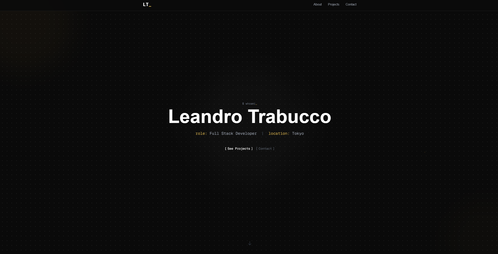
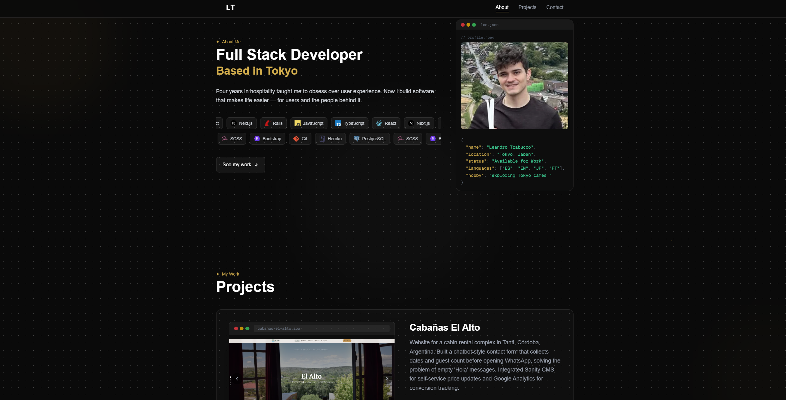
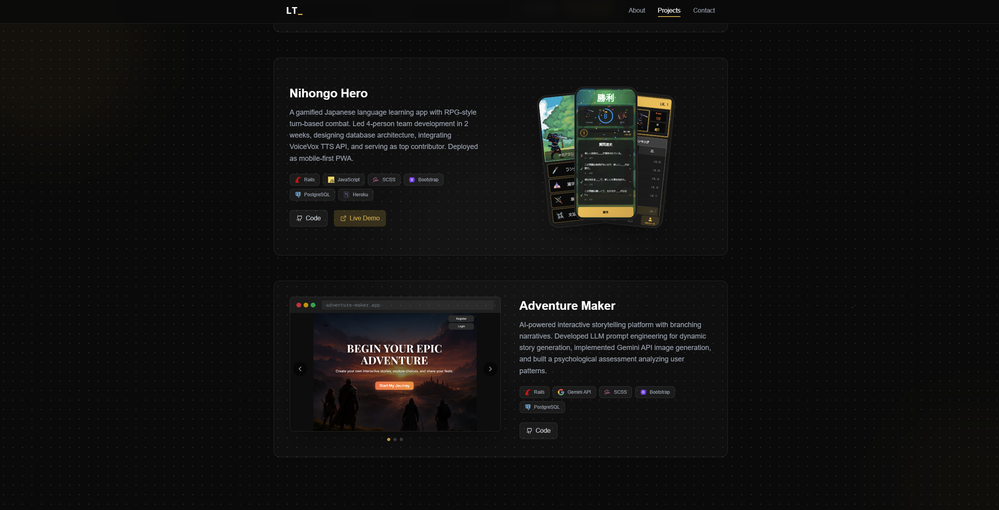

# 💻 leandrotrabucco.me

Terminal-inspired developer portfolio showcasing my projects and journey as a developer.

🔗 **Live:** [leandrotrabucco.me](https://leandrotrabucco.me)

## Screenshots

<p>
  
  
  
</p>

## Features

- **Terminal-style UI** with typewriter effects
- **Fully responsive** — mobile to desktop
- **Project showcase** with live demos
- **Bilingual resume downloads** (EN/JP)

## Tech Stack

Next.js · TypeScript · Tailwind CSS

## Run Locally
```bash
git clone https://github.com/LeoCba07/nextjs-portfolio.git
cd nextjs-portfolio
npm install
npm run dev
```

---

Built by [LeoCba07](https://github.com/LeoCba07)
